# Restitution de l'étude

## Choix de 3 modèles

Pour rester uniforme par ex dans la mise en commun des fonctions ou dans l'affichage et la comparaison des sorties,
on va utiliser des modèles qui ont la même stratégie de segmentation.
On exclue ici FlauBERT et CamemBERT car dans leur méthode de tokenisation, la syntaxe diffère.
🔬 Voir le resultat de l'étude [de la tokenisation](../model/SANDRINE/sandbox/Etude-tokenization.md)

## Finetuning des modèles

- [bert-base-multilingual-cased](../model/SANDRINE/finetuning-bert-base-fr-cased.ipynb)
- [bert-base-fr-cased](../model/SANDRINE/finetuning-bert-base-multilingual-cased.ipynb)
- [NER_MobileBert](../model/SANDRINE/finetuning-NER_MobileBert.ipynb)

## Comparaison des entrainements

| bert-base-multilingual-cased                                                         | bert-base-fr-cased                                                | NER_MobileBert                                                        |
| :----------------------------------------------------------------------------------- | :---------------------------------------------------------------- | :-------------------------------------------------------------------- |
| google                                                                               | Geotrend                                                          | SKNahin                                                               |
| Downloads last month 8780                                                            | Downloads last month 131                                          | Downloads last month 10                                               |
| Poids : 1.08 GB                                                                      | Poids : 499 MB                                                    | Poids : 98.5 MB                                                       |
| 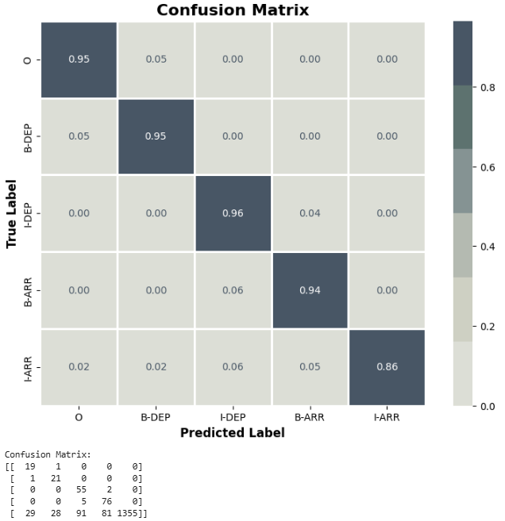                 |                  | 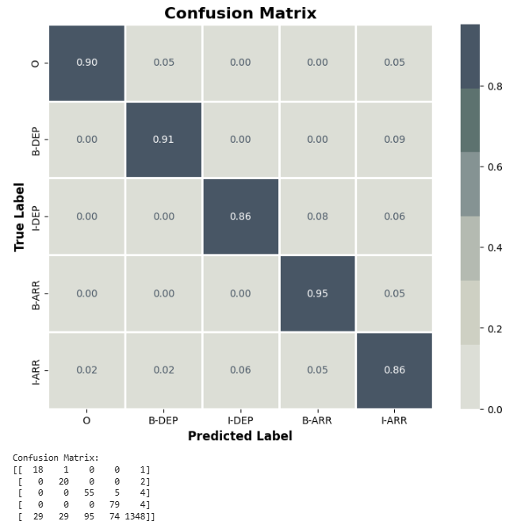                     |
| 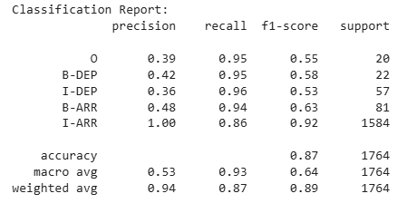 | 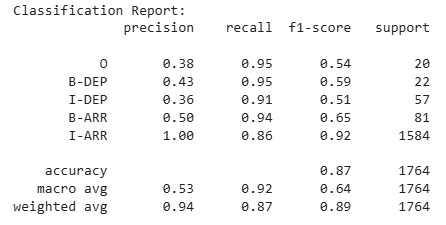 | 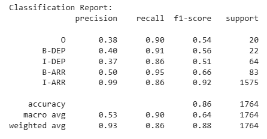 |
| 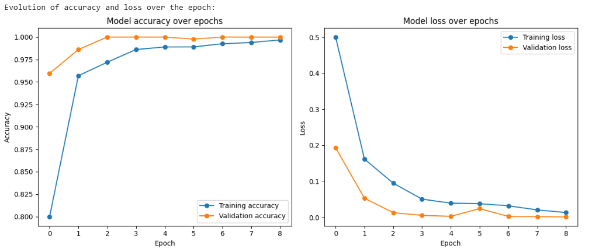                | 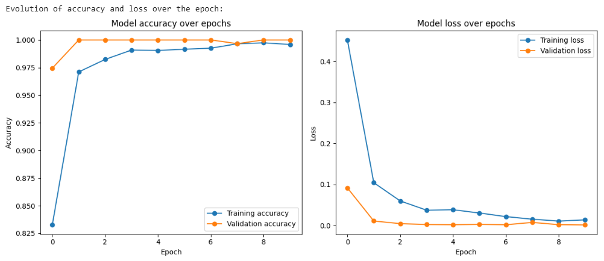                 | 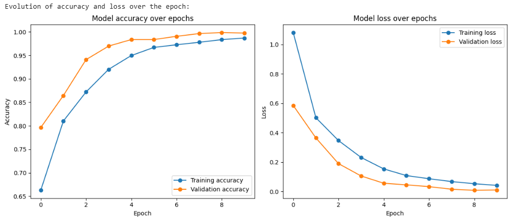                   |
| 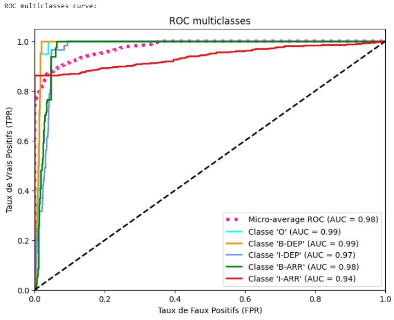                       | 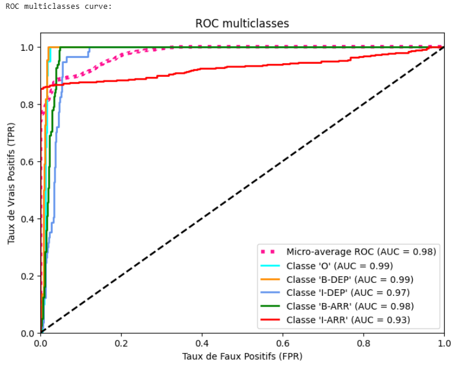                       | 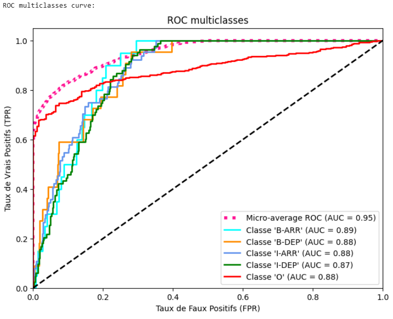                       |

## XAI

Explicabilité et interpretabilité  
[bert-base-multilingual-cased](../back/test/test-xai.ipynb)

On peut voir l'évolution de la répartition des poids à travers les 5 dernières couches

Output Tokens - le token que le modèle est en train d'analyser  
Input Tokens - l'ensemble des tokens disponibles en entrée sur lesquels le modèle peut "porter son attention"

- Les tokens regardent plusieurs autres tokens pour contextualiser leur sens
- Certains tokens se focalisent davantage sur un petit nombre de tokens
- Le modèle affine progressivement la représentation des mots, des liaisons, du sens
- L'embeding se stabilise avec des mots "autofocusé" pour la tâche de classification

| bert-base-multilingual-cased                                            | bert-base-fr-cased                                  | NER_MobileBert                                        |
| :---------------------------------------------------------------------- | :-------------------------------------------------- | :---------------------------------------------------- |
| 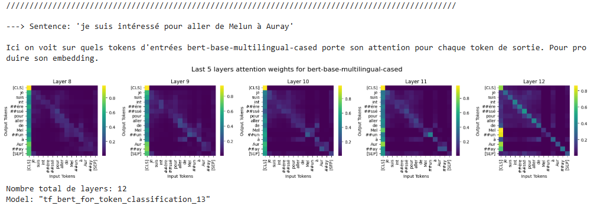   | 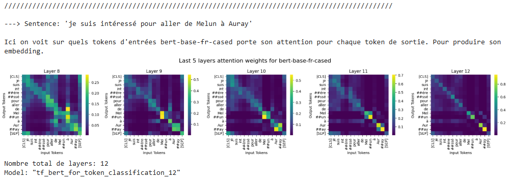   | 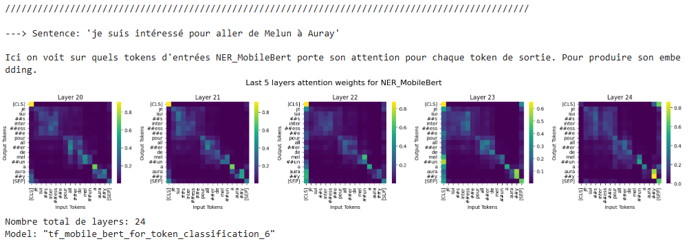   |
| 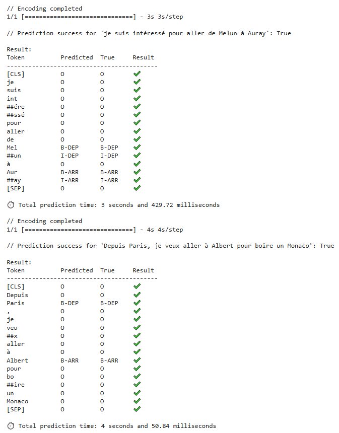 | 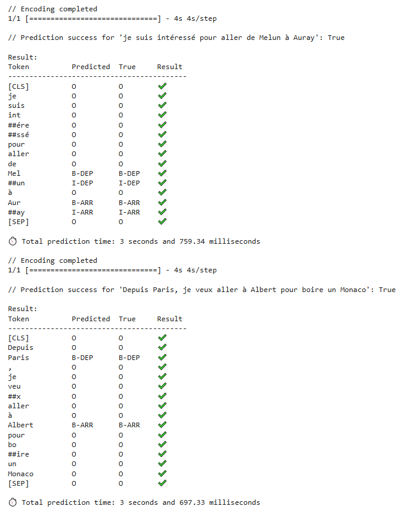 | 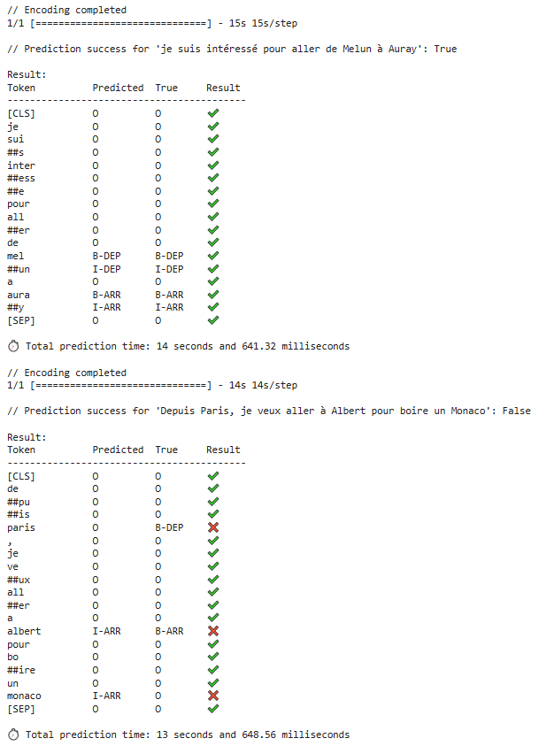 |
| _Autres informations multilingues ici_                                  | _Autres informations en français ici_               | _Autres informations sur NER ici_                     |
| Ligne 9                                                                 | Ligne 9                                             | Ligne 9                                               |
| Ligne 10                                                                | Ligne 10                                            | Ligne 10                                              |

### Conclusion

Les modèles bert-base-fr-cased et bert-base-multilingual-cased identifient correctement les entités de destination (DEP et ARR) dans les deux phrases sur des phrases simples.  
En revanche, le modèle NER_MobileBert montre des erreurs sur la deuxième phrase, échouant à détecter correctement "Paris", "Albert" et "Monaco".  
Ces résultats suggèrent que Les BERT sont plus performant que le MobileBERT.

## Choix du modèle final

🎉🎉🎉 Bert base fr
Il est plus rapide et déjà pré-entrainé sur le français.
