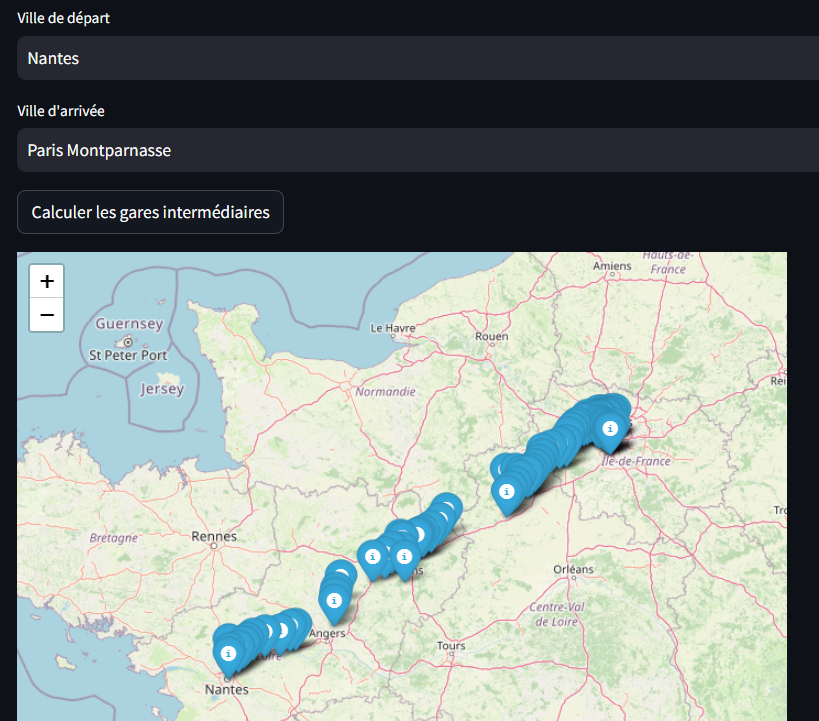
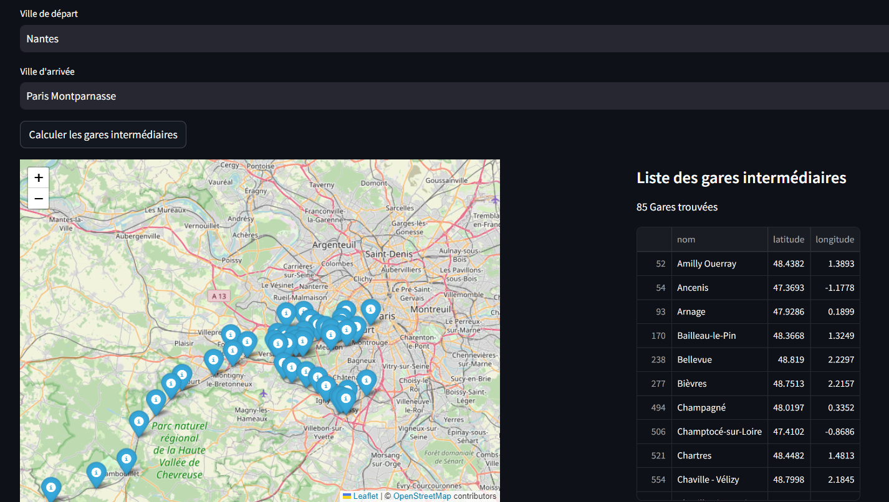
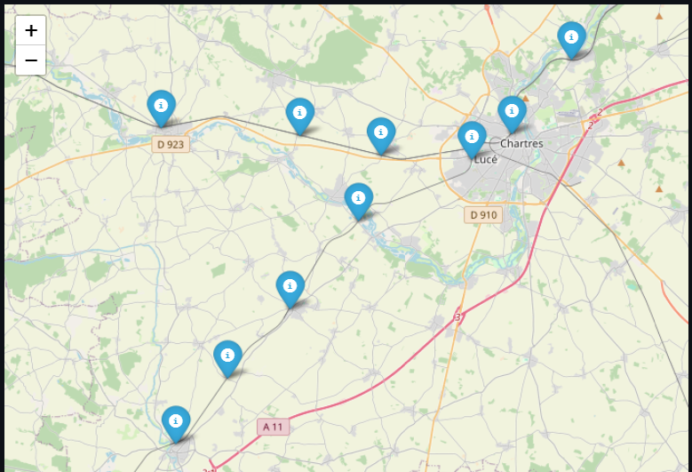
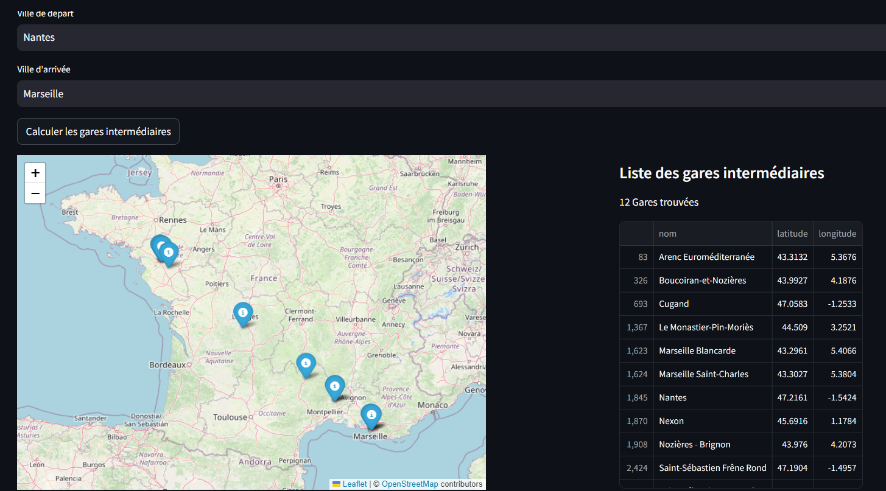

# Technical Assessment -> pathfinder

Objectif : Trouver le meilleur trajet - avec tous les arrêts - entre 2 coordonnées GPS

## Solution 1

Déterminer si une gare donnée se trouve sur une ligne tracée entre les 2 points (latitudes et longitudes). Le filtrage des gares intermédiaires s'effectue en fesant cette verification pour toutes les gares du DataFrame df.

- **Dataset**  
  🚉 gares-de-voyageurs.csv

- **Techno**  
  `pandas`: pour manipuler des tableaux 'csv'  
  `geopy.distance`: pourcalculer la distance geodesic entre deux coordonnées (latitude, longitude)  
  `shapely.geometry`: pour travailler avec des géométries (points, lignes) et calculer des distances

- **Script**  
  /script_pathfinder_one

**Problème rencontré**

L'algorythme trouve 85 gares entre Nantes et Paris Montparnasse et a tendance à mettre les gares qui sont certe dans l'axe de la ligne mais qui ne sont pas sur la trajectoire du train.

**Optimisation**  
En changeant la max_distance à 1 au lieu de 10, c'est à dire la distance maximal entre une gare et la ligne (départ arrivée) on a de meilleurs resultats mais il ne sont toujours pas réaliste par rapport aux lignes réélles.

## Solution 2

A la recherche des lignes férovières...  
🚧 en cours...

- **Dataset**  
  🚉 liste-des-gares.csv combiné avec d'autres...

- Données qui semblent pertinentes :

  - CODE_LIGNE et RG_TRONCON: décrivent le code de la ligne ferroviaire et le rang du tronçon
  - X_WGS84, Y_WGS84: Coordonnées géographiques WGS 84 (longitude et latitude)
  - PK: Position kilométrique de la gare sur la ligne

- **Techno**  
  `networkx`: pour travailler avec des graphes sous forme de nœuds et d'arêtes

- **Script**  
  /script_pathfinder_two
