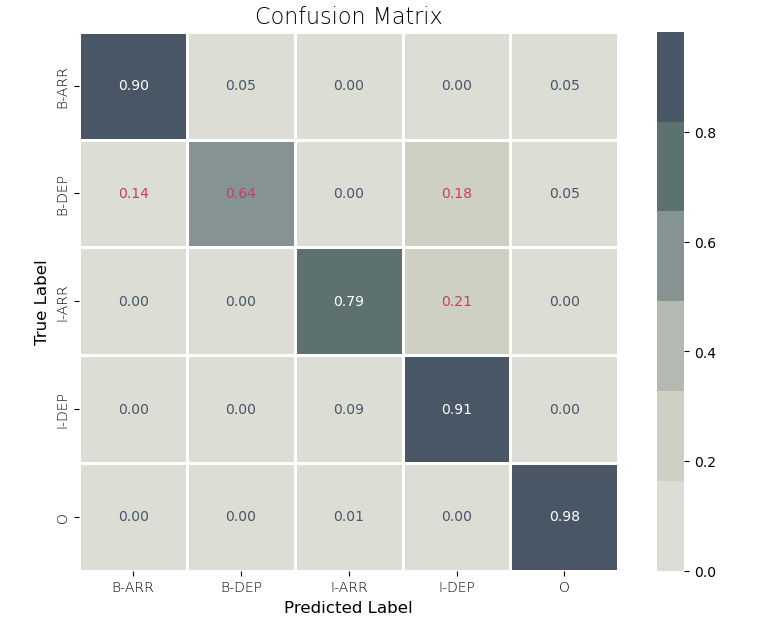
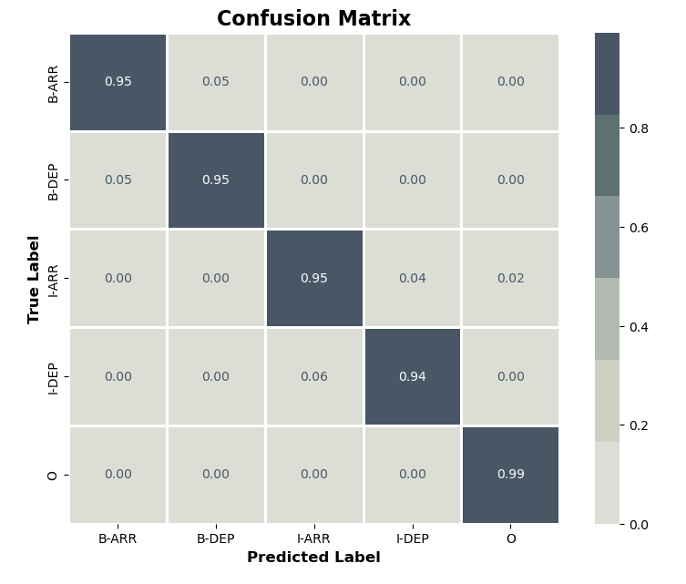
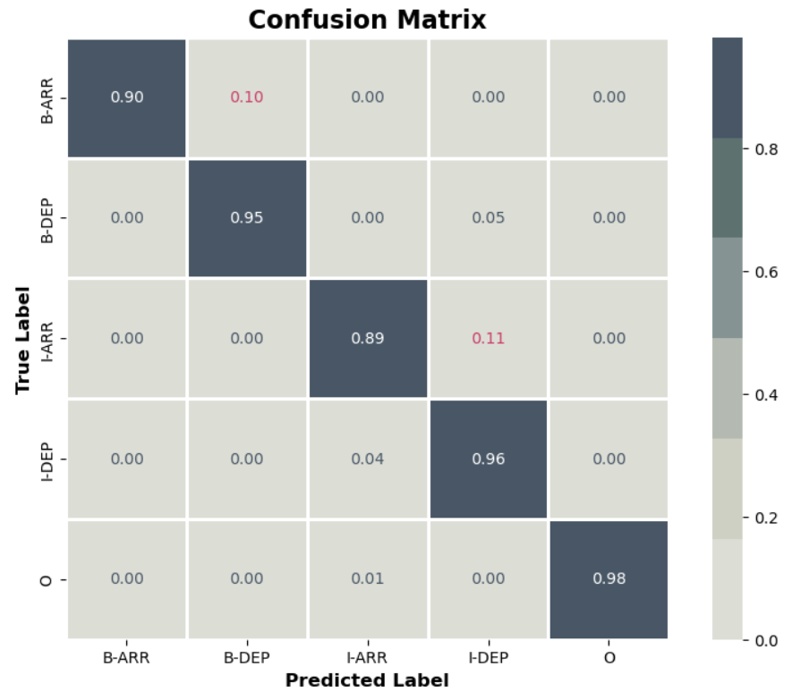

# Recherche pour tokenizer

## But de la recherche

La prediction d'un départ et d'une arrivé dans une phrase.

## install

```
pip install tensorflow pandas numpy transformers
pip install pandas transformers sacremoses nltk
```

## Phrases

📄 utilisation du fichier reservation-first-dataset-train.csv

```csv
# ex :
Phrase,Départ,Arrivée
"j'aimerais voyager de Ailly-sur-Somme à Aix-les-Bains le Revard","Ailly-sur-Somme","Aix-les-Bains le Revard"
"quels trains voyagent d'Alençon à Corbeil-Essonnes","Alençon","Corbeil-Essonnes"
```

### Script 1

Tokenisation avec `word_tokenize` de `NLTK`  
-> utilise simplement str.split()  
**Problèmes**

- Les contractions comme "d'Alençon" ne sont pas gérées
- Ne trouve pas l'entité

```json
   {
    "tokens": ["j'aimerais", "voyager", "de", "Ailly-sur-Somme", "à", "Aix-les-Bains", "le", "Revard"],
    "labels": ["O", "O", "O", "B-DEP", "O", "B-ARR", "I-ARR", "I-ARR"]
  },
  {
    "tokens": ["quels", "trains", "voyagent", "d'Alençon", "à", "Corbeil-Essonnes"],
    "labels": ["O", "O", "O", "O", "O", "B-ARR"]
  }
```

### Script 2

Introduction d'un `RegexpTokenizer` personnalisé pour gérer les contractions françaises  
REGEX : `r"\b(?:d'|l'|j'|qu'|n'|s'|t'|m'|c')?\w+\b"`  
Ce tokenizer tokenise à la fois les phrases et les mots  
ex: Ailly-sur-Somme est découpé en 3 tokens

**Problèmes**

- Contractions non séparées (ex: "d'Alençon" est un seul token)
- Erreur d'annotation

```json
  {
    "tokens": ["j'aimerais", "voyager", "de", "Ailly", "sur", "Somme", "à", "Aix", "les", "Bains", "le", "Revard"],
    "labels": ["O", "O", "O", "B-DEP", "I-DEP", "I-DEP", "O", "B-ARR", "I-ARR", "I-ARR", "I-ARR", "I-ARR"]
  },
  {
    "tokens": ["quels", "trains", "voyagent", "d'Alençon", "à", "Corbeil", "Essonnes"],
    "labels": ["O", "O", "O", "O", "O", "B-ARR", "I-ARR"]
  }
```

### Script 3

Amélioration
REGEX : `r"\b(?:d'|l'|j'|qu'|n'|s'|t'|m'|c')\b|\b\w+\b"`

- Sépare les contractions en deux tokens distincts ("d'" et "Alençon")

Très bon résultat

```json
  {
    "tokens": ["j'", "aimerais", "voyager", "de", "Ailly", "sur", "Somme", "à", "Aix", "les", "Bains", "le", "Revard"],
    "labels": ["O", "O", "O", "O", "B-DEP", "I-DEP", "I-DEP", "O", "B-ARR", "I-ARR", "I-ARR", "I-ARR", "I-ARR"]
  },
  {
    "tokens": ["quels", "trains", "voyagent", "d'", "Alençon", "à", "Corbeil", "Essonnes"],
    "labels": ["O", "O", "O", "O", "B-DEP", "O", "B-ARR", "I-ARR"]
  }
```

### Script 4

Observer la sortie des tokenizeurs entrainés sur du fr avec des lib d'Hugging Face. Le pipeline NER ne peut pas deviner par lui même le départ et l'arrivé sans être entrainé sur les données.

Chaque tokenizeur a sa propre stratégie de segmentation :

- CamemBERT et FlauBERT -> optimisés pour le français / conserver les mots entiers
- BERT français -> segmentation très fine
- BERT multilingue -> flexibilité linguistique mais peut sacrifier certaines spécificités

CamemBERT :

- Sépare "d" et l'apostrophe
- Utilise "▁" pour indiquer le début d'un nouveau mot

FlauBERT :

- Garde "d'" ensemble
- Utilise "</w>" pour indiquer la fin d'un mot
  Les traits d'union sont généralement tokenisés comme des tokens séparés ou utilisés pour segmenter les mots.
  Indicateurs de sous-mots :

BERT français et BERT multilingue :

- Utilisent "##" pour indiquer que le token est une continuation du précédent

```json
{
  "Phrase": "quels trains voyagent d'Alençon à Corbeil-Essonnes",
  "Départ": "Alençon",
  "Arrivée": "Corbeil-Essonnes",
  "Tokens": {
    "camembert-base": ["▁quels", "▁trains", "▁voyage", "nt", "▁d", "'", "Al", "en", "çon", "▁à", "▁Corb", "e", "il", "-", "Essonne", "s"],
    "flaubert/flaubert_base_cased": ["quels</w>", "trains</w>", "voyagent</w>", "d'</w>", "Alençon</w>", "à</w>", "Cor", "be", "il-", "Ess", "onnes</w>"],
    "dbmdz/bert-base-french-europeana-cased": ["quels", "trains", "voyage", "##nt", "d", "'", "Alençon", "à", "Corbeil", "-", "Ess", "##onnes"],
    "bert-base-multilingual-cased": ["quel", "##s", "trains", "voyage", "##nt", "d", "'", "Ale", "##nç", "##on", "à", "Cor", "##bei", "##l", "-", "Essonne", "##s"]
  }
}
```

#### Entrainement d'un modèle

Le but ici est de faire porter la tokenization et la prediction par un model finetuné pour notre besoin. On va utiliser BERT et son tokenizer Fast et tester différents paramétrages d'entrainement sur des données de train. Puis ensuite, évaluer le nouveau modèle sur des données de test.

**Configuration**

```markdown
- model de départ -> `bert-base-multilingual-cased`
- optimizer avec Adam
- Learning rate 5e-5 => (0.00005) = petite vitesse d'ajustement des poids
- `SparseCategoricalCrossentropy` -> fonction de perte pour le multiclasse
- `from_logits=True` -> "logits" = les sorties du modèle non normalisés -> avant de calculer la perte, la fonction appliquera une couche softmax interne pour convertir les logits en probabilité
- metrics=['accuracy'] pour surveiller la précision du modèle pendant l'entraînement et l'évaluation

- 3 epochs
- batch_size=16
```

**Resultat**

```sh

Matrice de confusion:
[[ 18   1   1   0   0]
 [  3  18   0   1   0]
 [  0   0  54   2   1]
 [  0   0  11  70   0]
 [  1   1   6   2 530]]

Rapport de classification:
              precision    recall  f1-score   support

           O       0.82      0.90      0.86        20
       B-DEP       0.90      0.82      0.86        22
       I-DEP       0.75      0.95      0.84        57
       B-ARR       0.93      0.86      0.90        81
       I-ARR       1.00      0.98      0.99       540

    accuracy                           0.96       720
   macro avg       0.88      0.90      0.89       720
weighted avg       0.96      0.96      0.96       720

```

**Test de variation des paramètres d'entrainement**
| batch size + | epoch + | batch size - |
|---|---|---|
| batch_size=36, <br>epoch=3 | batch_size=16, <br>epochs=10 | batch_size=9, <br>epochs=10 |
|  |  |  |

## Conclusion

Le script 3 qui est performant avec une approche simple sans entrainement de modèle.
La tokenization avec la lib python NLTK est basé sur une REGEX qui prend en compte les contractions du français (d'|l'|j'|qu'|n'|s'|t'|m'|c'). Cette méthode détecte correctement les entity (Départ, Arrivée) dans une forme naturelle des mots sans les sur-fragmenter en sous-tokens, comme le font les tokenizers de modèles pré-entraînés. De plus le format BIO (Begin, Inside, Outside) est plus lisible pour l'évaluation humaine.

Le modèle finetuné lui va permettre de faire les prediction sur les données inconnues.
IL est plus performant avec un plus petit batch.

Enfin, la solution envisagé pour que le modèle soit plus performant serait d'avoir beaucoup plus de données d'entrainement avec des cas atypiques.
